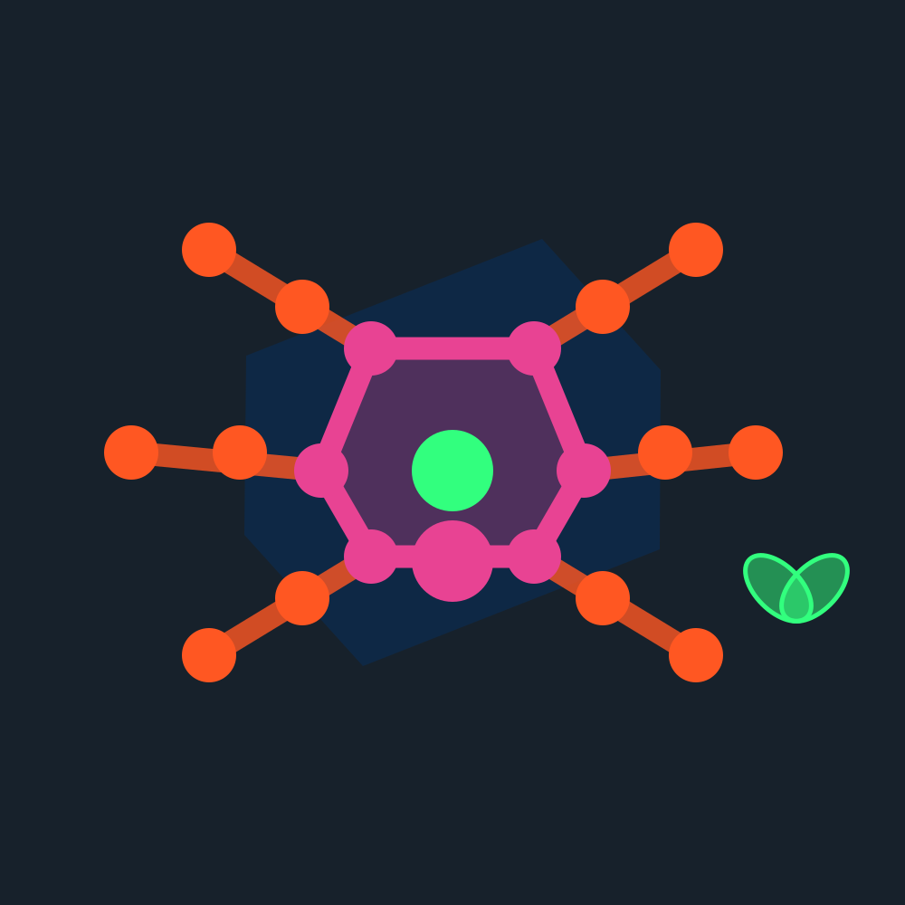
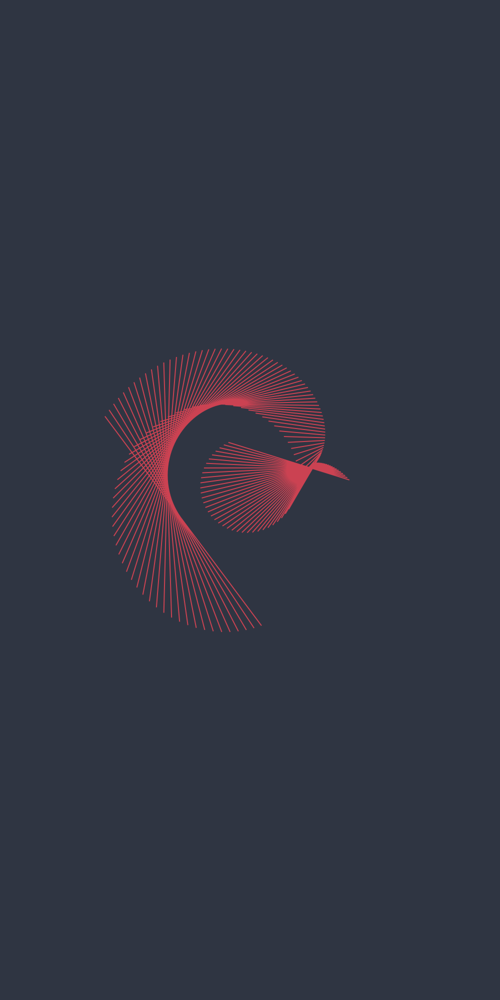

# A Bare Minimum 2D Plotter

> An extremely lightweight React component to declaratively (and elegantly) plot shapes on an inline SVG

[](https://www.npmjs.com/package/bare-minimum-2d)
[](https://bundlephobia.com/result?p=bare-minimum-2d@0.2.0)
[](https://bundlephobia.com/result?p=bare-minimum-2d@0.2.0)

## Update
You can now use your own shape implementation by passing it as a plugin (see [plugin section](./README.md#plugins) below for more information).
Here's an awesome plugin ([repository/source code](https://github.com/fuddl/bare-minimum-text-marker)) by [@fuddl](https://github.com/fuddl/) that you can download from [npm](https://www.npmjs.com/package/bare-minimum-text-marker). It allows you add text and custom markers. Here's the [demo application](https://fuddl.github.io/bare-minimum-text-marker/) where it is used in conjuction with [Bare Minimum 3d](https://github.com/mithi/bare-minimum-3d).

## Demo Applications

| Responsive Illustrations                                                            | On-The-Fly Animations                                                               | Interactive Applications                                                            |
| ----------------------------------------------------------------------------------- | ----------------------------------------------------------------------------------- | ----------------------------------------------------------------------------------- |
| [][demo_link1] | [][demo_link2] | [][demo_link3] |
| [demo][demo_link1]                                                                  | [demo][demo_link2]                                                                  | [demo][demo_link3]                                                                  |
| [source code][source_link1]                                                         | [source code][source_link2]                                                         | [source code][source_link3]                                                         |

[demo_link1]: https://bare-minimum-2d.netlify.app/demo1
[demo_link2]: https://bare-minimum-2d.netlify.app/demo2
[demo_link3]: https://bare-minimum-2d.netlify.app/demo3
[source_link1]: https://github.com/mithi/bare-minimum-2d/blob/master/example/src/demo1/demo.js
[source_link2]: https://github.com/mithi/bare-minimum-2d/blob/master/example/src/demo2/demo.js
[source_link3]: https://github.com/mithi/bare-minimum-2d/blob/master/example/src/demo3/demo.js

## Install

```bash
npm install --save bare-minimum-2d
```

## Usage

This is [an example](./example/src/demo1/demoProps.js) of what you can pass to a `BareMinimum2d` component.

You pass it like so:

```jsx
import BareMinimum2d from 'bare-minimum-2d'

<div style={{ width: '100%', height: '100vh' }}>
  <BareMinimum2d {...{ data, container }} />
</div>
```

The component takes the dimensions of its parent and is always centered

## Everything you need to know explained in two minutes

A `BareMinimum2d` component only has two props: `container` and `data`. `container` is a small object with exactly four elements. `data` is an array containing objects.

Example:

```jsx
import BareMinimum2d from 'bare-minimum-2d'

const container = {
  color: '#0000FF',
  opacity: 0.2,
  xRange: 300,
  yRange: 500
}

const data = [{
  x: [0],
  y: [0],
  color: "#FFFFFF",
  opacity: 1.0,
  size: 10,
  type: 'points',
  id: 'center'
}]

<div style={{ width: "100%", height: "100vh" }}>
  <BareMinimum2d {...{ data, container }} />
</div>
```

`container.color` and `container.opacity` specifies the canvas color of `BareMinimum2d`.

The cartesian coordinate system of `BareMinimum` will follow the diagram below given `container.xRange` and `container.yRange`. Position (0, 0) will always be at the center of the rendered component.

```js
                  yRange/2
                     |
                     |
  -xRange/2 -------(0,0)--------- xRange/2
                     |
                     |
                   -yRange/2
```

Please take a look at more [complex example data prop](./example/src/demo1/demoProps.js) to get the idea.
each element of the array `data` should be a hash-like objectwith a `type` key which should have a value that is one of
the following:

| points | ellipse  | lines  | polygon  |
| ------ | -------- | ------ | -------- |
| plural | singular | plural | singular |

Elements of the `data` array will be stacked based on the order they are declared.
The first element will be at the most bottom layer while the last element of the array will be at the top.

All attributes are ALWAYS required, nothing is optional because there are no default values. The `id` attribute must be unique for each element of the `data` array.

### Plugins

* [`text-marker`](https://www.npmjs.com/package/bare-minimum-text-marker) ([Demo](https://fuddl.github.io/bare-minimum-text-marker/))
* [`quadratic-bezier`](https://www.npmjs.com/package/bare-minimum-quadratic-bezier) ([Demo](https://fuddl.github.io/bare-minimum-quadratic-bezier/))

#### Create your own

You can add your own shapes as a plugin for example, here's an example plugin written by [@fuddl](https://github.com/fuddl)

```jsx

const Triangle = ({ x, y, transforms, size, color, opacity, id, i }) => {
  const cx = transforms.tx(x)
  const cy = transforms.ty(y)
  const ySize = size * 0.8626
  return (
    <polygon
      {...{
        opacity,
        id: `${id}-${i}`,
        fill: color
      }}
      points={[
        `${cx},${cy - ySize}`,
        `${cx + size},${cy + ySize}`,
        `${cx - size},${cy + ySize}`
      ].join(' ')}
    />
  )
}

const trianglesPlugin = {
  triangle: (element, transforms) => {
    const { size, color, opacity, id } = element
    return element.x.map((x, i) => (
      <Triangle
        {...{
          x,
          y: element.y[i],
          size,
          color,
          opacity,
          id,
          i,
          transforms
        }}
        key={`${id}-${i}`}
      />
    ))
  }
}
```

And you can use it like so:

```jsx
const triangle = {
  "x": [-163.72675374383329],
  "y": [-154.33259574213795],
  "opacity": 1,
  "size": 60,
  "color": "#2196F3",
  "type": "triangles",
  "id":"points0"
}

<div style={{ width: "100%", height: "100vh" }}>
  <BareMinimum2d {...{ data: [triangle], container, plugins: [trianglesPlugin] }} />
</div>
```

END

## Contributing

1. Clone this repository.
2. Add your changes
3. You can add a demo or update the demo based on your changes somewhere [here](https://github.com/mithi/bare-minimum-2d/tree/master/example/src)
4. After making your change go run the following command to see if it works as you expect.
```
npm install && npm run build && rm -rf node_modules && cd example && npm install && npm run start
```

PRs welcome! Please read the [contributing guidelines](https://github.com/mithi/mithi/wiki/Contributing) and the [commit style guide](https://github.com/mithi/mithi/wiki/Commit-style-guide)!

## License

MIT © [Mithi](https://github.com/mithi)
